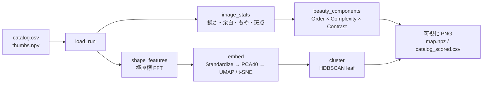

# Generative Flower — Order × Chaos

**🌐 Web ページ: https://york-14.github.io/Generative-flower-Order-Chaos/**

対称カオス写像（*symmetric icons*）が描く「花」のような図形を大量に探索し、

1. **形の地図** — 回転・鏡映に不変な形状特徴を 2 次元に埋め込み（UMAP / t-SNE）、HDBSCAN でクラスタに分ける
2. **美しさの評価関数** — `Beauty = Order^wO × Complexity^wC × Contrast^wK`
3. **重みの較正** — 人間の一対比較（A と B どちらが美しいか）から Bradley–Terry モデルで `wO, wC, wK` を推定

を行う解析ツール `shape_map.py` です。

「秩序（対称性）」と「カオス（フラクタル・不安定性）」がちょうど釣り合ったところに美しさがある、という仮説を数値で扱えるようにすることが目的です。

---

## 背景：Symmetric Icons

カタログの列 `lam, alpha, beta, gamma, omega, n` は、Field & Golubitsky の対称カオス写像（複素平面上の写像）

$$
z_{t+1} = \left(\lambda + \alpha |z|^2 + \beta\,\mathrm{Re}(z^n) + i\omega\right) z + \gamma\,\bar{z}^{\,n-1}
$$

のパラメータに対応します。この写像は $n$ 回回転対称（$\omega = 0$ なら鏡映も含む二面体群 $D_n$）を持ち、軌道を長時間プロットするとアトラクタが対称な「花」の模様になります。

`shape_map.py` は、この探索を行う **`symmetric_icons.py`（本リポジトリ外）** の出力を入力として受け取ります。

---

## 処理の流れ



### 1. 形状特徴（回転・鏡映不変）

| 関数 | 内容 |
|---|---|
| `polar_resample` | サムネイル `(N,H,H)` を中心まわりの極座標 `(N, n_r=16, n_θ=256)` に双線形補間で再標本化 |
| `shape_features` | 各半径リングで角度方向に FFT。振幅 `\|FFT_m\|` は回転では位相しか変わらず、実信号なので反転でも不変 → **回転・鏡映不変**。DC 成分で正規化し `log1p(10·x)` で圧縮。半径方向の平均プロファイルも連結 |

特徴量の 2 つのモード：

| モード | 使う周波数 | 地図の性格 |
|---|---|---|
| `full` | `m = 1 … 48` | 対称次数 *n* も形の一部。地図は主に「何回対称か」で大きく分かれ、その中で形が並ぶ |
| `petal` | `m = k, 2k, …, 10k`（*k* = 検出された回転次数） | 対称性を「割り算」して、基本領域（花びら 1 枚）の描き方だけを比較。5 回対称と 8 回対称の花でも花びらが似ていれば近くに来る |

### 2. 埋め込みとクラスタリング

- `embed`: 形状特徴を標準化 → PCA（最大 40 次元）→ RMS 正規化。さらにスカラー指標（ボックス次元、log Lyapunov、エントロピー、充填率、鏡映スコア）を重み `0.5` で連結（**形が主、指標は従**）。UMAP（`n_neighbors=30, min_dist=0.15`）があれば UMAP、なければ t-SNE。
- `cluster`: HDBSCAN（`cluster_selection_method="leaf"`, `min_samples=8`, `min_cluster_size = max(10, N/80)`）。
  - `space="map"`（既定）: 2 次元地図上の密度で切る → 地図の見た目と一致
  - `space="feature"`: PCA 10 次元の特徴空間で切る → 距離の意味に忠実
  - 外れ値（ラベル −1）は最寄りクラスタ重心に割り当て、地図上では薄く表示

### 3. 美しさの評価関数

$$
\mathrm{Beauty} = O^{w_O}\cdot C^{w_C}\cdot K^{w_K}\qquad(\text{既定 } w_O=w_C=w_K=1)
$$

「中庸が最も好まれる」という **Wundt 曲線（逆 U 字）** をガウス型 `bell(x, μ, σ)` で、「多いほど良い／悪い」をシグモイドで表しています。

#### Order（秩序）*O*

| 要素 | 式 | 意味 |
|---|---|---|
| `o_k` | `bell(log k, log 6, 0.55)` | 回転次数はおよそ 4〜10 回を好む |
| `o_mirror` | `0.65 + 0.35·clip(mirror_score, 0, 1)` | 鏡映対称があると加点 |
| `o_angular` | `sigmoid(angular_contrast, 0.25, 0.07)` | 角度方向に模様が読み取れるか（円環に近いと低い） |
| 特例 | group が `O2~`（ほぼ円対称）→ `0.3` に固定 / `degenerate_1d`（直線・スポーク状）→ ×0.25 | |

`O = (o_k · o_mirror) · (0.3 + 0.7 · o_angular)`

#### Complexity（複雑さ）*C*

| 要素 | 式 | 意味 |
|---|---|---|
| `c_D` | `bell(boxdim, 1.72, 0.11)` | フラクタル次元：線（1）でも塗りつぶし（2）でもない中庸 |
| `c_lyap` | `bell(log λ₁, log 0.35, 0.7)` | 最大 Lyapunov 指数：弱すぎず強すぎないカオス |

`C = √(c_D · c_lyap)`

#### Contrast（図と地）*K*

`image_stats` がサムネイルから計算する統計量を使います。

| 統計量 | 定義 |
|---|---|
| `sharpness` | 占有画素の平均勾配 ÷ 平均輝度（フィラメント・輪郭の鋭さ） |
| `negative_space` | 外接円内でアトラクタが占めない割合（余白） |
| `haze` | 占有画素のうち暗い画素（0.02 < I < 0.4）の割合（淡いもや） |
| `speckle` | 4 近傍の半分以上が空の孤立画素の割合（ノイズ） |
| `dynamic_range` | 明暗の標準偏差 ÷ 平均（出力のみ、評価には未使用） |

| 要素 | 式 |
|---|---|
| `k_sharp` | `sigmoid(sharpness, 中央値, IQR/2)`（データ分布から自動設定） |
| `k_neg` | `bell(negative_space, 0.45, 0.22)` — 適度な余白 |
| `k_clarity` | `(1 − 0.6·sigmoid(haze, 0.5, 0.1)) · (1 − 0.7·sigmoid(speckle, 0.2, 0.04))` |

`K = ∛(k_sharp · k_neg · k_clarity)`

パラメータはすべて `DEFAULT_BEAUTY` 辞書にまとまっており、`beauty_components(cat, stats, p={...})` で部分的に上書きできます。

### 4. 一対比較からの重み較正（Bradley–Terry）

`fit_weights_from_pairs(comp, pairs)` は、効用を

$$
u_i = \log B_i = w_O \log O_i + w_C \log C_i + w_K \log K_i
$$

とし、$P(i \succ j) = \sigma(u_i - u_j)$ を切片なしロジスティック回帰で当てはめます（対称化のため反転サンプルも追加、負の重みは 0 にクリップ）。

```python
from shape_map import load_run, image_stats, beauty_components, fit_weights_from_pairs

cat, thumbs = load_run("out/run1")
comp = beauty_components(cat, image_stats(thumbs))
pairs = [(12, 40), (7, 3), ...]                 # (勝った index, 負けた index)
w = fit_weights_from_pairs(comp, pairs)         # {'wO': ..., 'wC': ..., 'wK': ...}
comp2 = beauty_components(cat, image_stats(thumbs), p=w)
```

---

## 使い方

```bash
pip install -r requirements.txt

python shape_map.py --run out/run1                 # 全形の地図 + 美しさ（full モード）
python shape_map.py --run out/run1 --mode petal    # 花びら地図
python shape_map.py --run out/run1 --out my_map    # 出力先を指定
```

### 入力（`--run` ディレクトリ）

| ファイル | 内容 |
|---|---|
| `catalog.csv` | 1 行 1 個体。必須列: `id, n, k, k_orbit, group, map_group, lyap, boxdim, entropy, fill, mirror_score, angular_contrast, degenerate_1d`。任意: `lam, alpha, beta, gamma, omega, R, alive, breaking_amp, symmetry_broken, extra_mirror` |
| `thumbs.npy` | `uint8` 配列 `(N, H, H)`。中心が原点の正方形サムネイル（輝度 0–255） |

### 出力（既定: `<run>/map_<mode>/`）

| ファイル | 内容 |
|---|---|
| `shape_map.png` | 埋め込み平面を 22×22 のグリッドに切り、各セルで美しさ最大の個体のサムネイルを配置した「形の地図」 |
| `clusters.png` | 3 面図：HDBSCAN クラスタ / 写像次数 *n* / 美しさスコア |
| `cluster_gallery.png` | クラスタごと（美しさの中央値順、最大 24）に上位 8 個を 1 行に並べたギャラリー |
| `beauty_top.png` | 美しさ上位 40 個と O / C / K の内訳 |
| `wundt_check.png` | `Order × Contrast` とボックス次元・Lyapunov 指数の関係（逆 U 字が出るかの確認用） |
| `map.npz` | 埋め込み座標 `Y`、クラスタ、外れ値フラグ、全スコア成分、画像統計量 |
| `catalog_scored.csv` | 元の `catalog.csv` に `x, y, cluster, beauty, order, complexity, contrast` と画像統計量を追記 |

---

## 動作環境

- Python 3.9+
- `numpy`, `matplotlib`
- `scikit-learn >= 1.3`（`sklearn.cluster.HDBSCAN` を使用）
- `umap-learn`（任意。無ければ t-SNE に自動フォールバック）

## コード解析メモ

- `catalog.csv` の `True` / `False` 文字列は `== "True"` で真偽値化しています。
- `plot_thumbnail_map` 内の `+ (Y[:, 0] * 0)` は値に影響しない項です（削除しても結果は同じ）。
- `catalog_scored.csv` は `csv` モジュールを使わず手書きで出力しているため、元 CSV の値にカンマが含まれると列がずれます。
- 評価関数のパラメータ（`k_mu=log 6`, `D_mu=1.72` など）は経験的な初期値であり、`fit_weights_from_pairs` による較正を前提としています（現状の較正対象は指数 `wO, wC, wK` のみ）。

## Web ページ（GitHub Pages）

`docs/index.html` が Web ページ本体です（ビルド不要の 1 ファイル）。

| 機能 | 内容 |
|---|---|
| 描画スタジオ | パラメータ λ, α, β, γ, ω, n をスライダーで操作し、ブラウザ上でアトラクタを描画。プリセット・ランダム探索・PNG 保存 |
| 色彩の調整 | パレット（マグマ／氷・海／桜／金箔／翡翠／墨 など）、カスタム 3 色グラデーション、色相回転、ガンマ、露出、背景色。軌道を再計算せずに即座に塗り直す |
| 好みの学習 | 2 つの花を並べて好きな方を選ぶ（クリック または ← / →）。選択のたびにブラウザ内で Bradley–Terry モデルを再推定し、出題と「あなた好みの花を描く」に反映 |

### 好みの学習の仕組み

- 各候補について、軌道を 128×128 のヒストグラムに落として **ボックス次元・余白率・もや率・斑点率・角度コントラスト・最大 Lyapunov 指数** を計算し、`shape_map.py` の `Order / Complexity / Contrast` をブラウザ用に近似します。
- 効用は `u = wO·log O + wC·log C + wK·log K + Σ vj·φj`（φ = 対称数・次元・カオスの強さ・余白などの 1 次・2 次項）。
- 初期の評価関数（`w = 1, v = 0`）を事前分布とする L2 正則化付きロジスティック回帰で、選択のたびに全比較データから再推定します。比較が少ないうちは初期関数に近く、増えるほど個人の好みに寄ります。
- 出題の半分は「現在のモデルで最良の候補」を含め、残りはランダム（探索と活用のバランス）。
- 学習データと色彩設定は **そのブラウザの localStorage にのみ保存** され、外部には送信されません（端末・ブラウザごとに別々の学習になります。「学習をリセット」で消去）。
- 学習結果は「初期の評価関数からのずれ」として棒グラフで表示されます（右 = 好き、左 = 苦手）。
